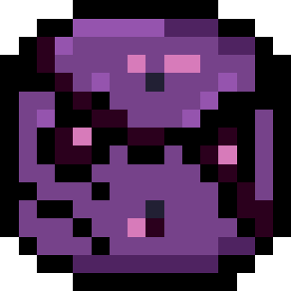

    

## RaveRunner
Game made for jumpstart haven
A gravity-flipping runner through a neon rave. Dodge and parry discs fired by enemy bots as you race to claim the Magic Rave Horn.

## Inputs

Press E to parry

Press W or S to change gravity

## Special Thanks to
[Hack Club](https://hackclub.com) haven and Jumpstart team for the guides and extension

## You might also like
Check out some of my other projects:
- [BlurryProject](https://github.com/Cocotrilito/BlurryProject) - An Image blurrer
- [BobaBashPhotoWall](https://github.com/Cocotrilito/BobaBashPhotoWall) - A live, shared photo wall for Boba Bash events worldwide.
